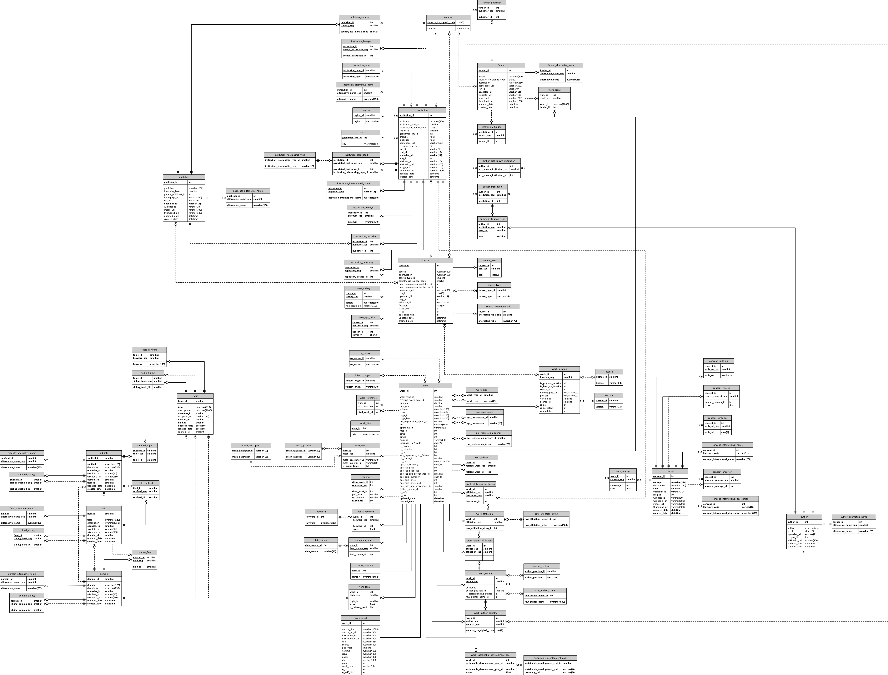

# CWTS OpenAlex databases

This repository contains the source code used by [CWTS](https://www.cwts.nl) (Centre for Science and Technology Studies, Leiden University) to extract, transform, and load (ETL) data from [OpenAlex](https://openalex.org) into a Microsoft SQL Server database system.

The source code produces five Microsoft SQL Server databases:

(1) Database containing data from OpenAlex in a relational format.

(2) Database containing titles and abstracts of publications.

(3) Database containing data on core publications.

(4) Database containing a classification of publications into research areas.

(5) Database containing stored procedures for indicator calculations.

See [this blog post](https://www.leidenmadtrics.nl/articles/introducing-the-leiden-ranking-open-edition) for more information about databases (3), (4), and (5).

This repository makes use of the [CWTS ETL tooling repository](https://github.com/CWTSLeiden/CWTS-ETL-tooling), the [publicationclassification repository](https://github.com/CWTSLeiden/publicationclassification), and the [publicationclassificationlabeling repository](https://github.com/CWTSLeiden/publicationclassificationlabeling).

## Database structure and diagram

Database (1), containing data from OpenAlex in a relational format, is organized into multiple interrelated tables representing key OpenAlex entities such as works, authors, institutions, and sources, along with their relationships.

The diagram below presents the structure of this relational database:

## Availability in Google BigQuery

The ETL process also includes functionality to make the extracted and transformed data available in Google BigQuery.

In addition to the Microsoft SQL Server environment, databases (1), (3), and (4) are publicly available in the [Google BigQuery environment of CWTS](https://console.cloud.google.com/bigquery?project=cwts-leiden), enabling cloud-based querying and large-scale analysis.
